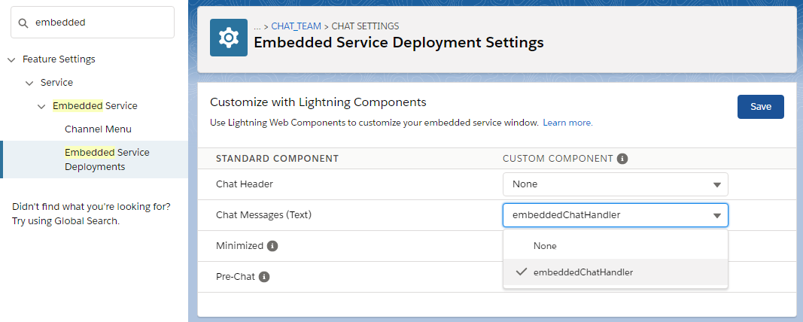
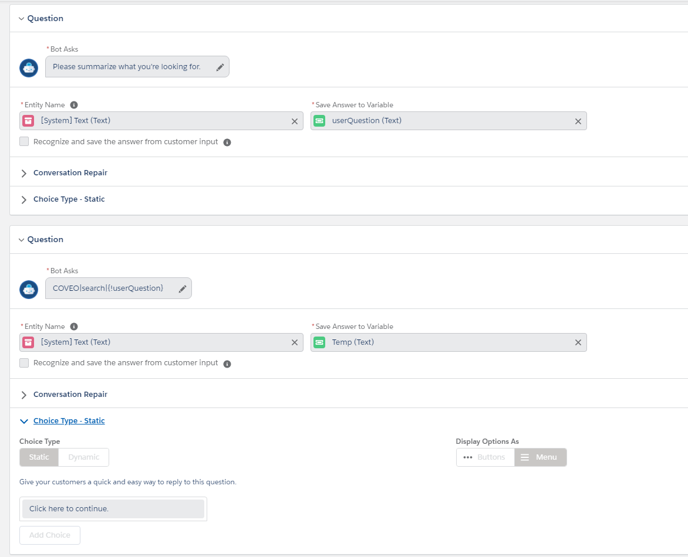
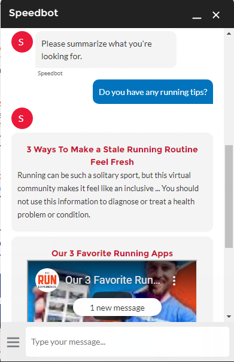

# Coveo components for Einstein bots.

This projects includes components made with Salesforce's Einstein bots in mind. Many of the interactions a user could have with a chatbot could benefit greatly from finding the right information or the right answer to a question. Coveo offers multiple features that could become useful to the user given the opportunity to integrate with a chatbot.

Einstein bots used with Embedded Service in a Lightning community [allow you to replace the default message rendering component in the chat window](https://developer.salesforce.com/docs/atlas.en-us.snapins_web_dev.meta/snapins_web_dev/embedded_services_web_lightning_web_components.htm). This repository includes components to help you use [Coveo's Search API](https://docs.coveo.com/en/52/cloud-v2-developers/search-api) and [Coveo's Usage Analytics API](https://docs.coveo.com/en/1430/cloud-v2-developers/usage-analytics-write-api) in order to equip your Einstein bot with search functionnality.

This repository presents the building blocks in order to integrate the different Coveo capabilities within Salesforce's Einstein bots. The search functionality presented here is just an example of how to leverage the different APIs Coveo offers that could be useful to your chatbot.

## How to deploy

These steps assume you already have the [Coveo for Salesforce package installed](https://docs.coveo.com/en/1158/coveo-for-salesforce/getting-started-with-coveo-for-salesforce) and configured (linked to a Coveo organization).

### 1. Setup your local environment with Visual Studio Code and SFDX-cli

Salesforce recommends Microsoft's Visual Studio Code as the preferred IDE. Follow these instructions in order to complete your local setup. These will guide you through installing both VSCode and SFDX-cli.

https://developer.salesforce.com/tools/vscode/en/getting-started/install

### 2a. Deploying the project with the Org Development Model

The org development model allows you to connect directly to a non-source-tracked org (sandbox, Developer Edition (DE) org, Trailhead Playground, or even a production org) to retrieve and deploy code directly. This model is similar to the type of development you have done in the past using tools such as Force.com IDE or MavensMate.

To start developing with this model in Visual Studio Code, see [Org Development Model with VS Code](https://forcedotcom.github.io/salesforcedx-vscode/articles/user-guide/org-development-model). For details about the model, see the [Org Development Model](https://trailhead.salesforce.com/content/learn/modules/org-development-model) Trailhead module.

When working with non-source-tracked orgs, use the commands `SFDX: Deploy Source to Org` (VS Code) or `sfdx force:source:deploy` (Salesforce CLI) and `SFDX: Retrieve Source from Org` (VS Code) or `sfdx force:source:retrieve` (Salesforce CLI). The `Push` and `Pull` commands work only on orgs with source tracking (scratch orgs).

### 2b. Pushing the code in a Scratch Org

When working with source-tracked orgs, use the commands `SFDX: Push Source to Org` (VS Code) or `sfdx force:source:push` (Salesforce CLI) and `SFDX: Pull Source from Org` (VS Code) or `sfdx force:source:pull` (Salesforce CLI). Do not use the `Retrieve` and `Deploy` commands with scratch orgs.

### 3. Set this component as the Embedded Service Deployment **Chat Messages (Text)** component

In Setup, search for "Embedded" and select **Embedded Service Deployments**.

Click on your deployment and select View.

Then click Edit under **Chat Settings**.

Now set the LWC deployed as part of that package as the Chat Messages handler.

Press Save.

### 4. Executing a search

In order to trigger the specific behavior available with this component, you must send a properly formatted message as the Eintein bot to the customer. Here is how.

First, add a Question to the bot prompting the user for a question or a search to execute.

Store that response into a variable, in the example above: `userQuestion (Text)`.

Then ask another question with this exact text format: `COVEO|search|{!userQuestion}`.

The `COVEO|search` portion of the message is used to signify that there is a special behavior to execute here instead of only displaying the message as text. The `{!userQuestion}` is the syntax used in Eintein bots in order to write the value of the variable created in the previous step.

## What's included in this repository

In this code sample, the included components can send a query to your Coveo organization, render the results in a specific display style. They will take care of generating a **search token**, also take care of sending a **search event** for an executed query and will send **click events** whenever a result is clicked on.

Here is a preview of what it looks like:

## Deploying to Production

Keep in mind this code is distributed as-is. It is free to use, but is not an official Coveo product, and should be considered a community project - these components are not officially tested or documented.

Don’t deploy your code to production directly from Visual Studio Code. The deploy and retrieve commands do not support transactional operations, which means that a deployment can fail in a partial state. Also, the deploy and retrieve commands don’t run the tests needed for production deployments. The push and pull commands are disabled for orgs that don’t have source tracking, including production orgs.

Deploy your changes to production using [packaging](https://developer.salesforce.com/docs/atlas.en-us.sfdx_dev.meta/sfdx_dev/sfdx_dev_dev2gp.htm) or by [converting your source](https://developer.salesforce.com/docs/atlas.en-us.sfdx_cli_reference.meta/sfdx_cli_reference/cli_reference_force_source.htm#cli_reference_convert) into metadata format and using the [metadata deploy command](https://developer.salesforce.com/docs/atlas.en-us.sfdx_cli_reference.meta/sfdx_cli_reference/cli_reference_force_mdapi.htm#cli_reference_deploy).

## Advanced details

This component as an example handles displaying YouTube videos in an embedded iframe as an example of how you can display different results. It also contains another condition for an "Answer" type of result as an example.

### How it handles the search token

The search token is being generated server-side using an [Apex class packaged in the Coveo for Salesforce package](https://docs.coveo.com/en/1075/coveo-for-salesforce/globals-class#generatesearchtoken). That way you can include additional filters, set the searchhub, etc. It will also by default include the identity of the current user if the user is authenticated. The generated token is saved in the `sessionStorage` for future use to avoid generating a token every time the user would ask a question in the same chat session.

### What kind of analytics events are supported?

Right now this code will send a **search** event for a user query, along with **click** events whenever a user clicks on the result title to navigate to the page. You can add more events, including custom events yourself, look in the [`analytics.js`](./force-app/main/default/lwc/analytics/analytics.js) file.

### How do you handle a "visit"?

The way to link all events to be part of the same visit at Coveo is using the [visitorId](https://docs.coveo.com/en/3320/cloud-v2-administrators/understanding-the-visitor-id-and-visit-id-dimensions#visitor-id) parameter on every analytics events. This examples takes care of reading its own localStorage value and use the same `visitorId` on each events.

This is important for unauthenticated users in order to keep matching the current chatbot session with the other actions on the community for example.

For authenticated users, read this scenario explaining how Coveo handles [user stitching for authenticated users](https://docs.coveo.com/en/3297/coveo-machine-learning/understanding-user-stitching#scenario-5).

### Give Guest Users Access to Apex Classes

If your chatbot is exposed to guest users (users who are not logged in), ensure that your guest users have access to the `LWCEndpointController` Apex class. Use the Salesforce Experience Builder to perform this verification and provide access, if necessary. [This Salesforce critical update](https://releasenotes.docs.salesforce.com/en-us/winter20/release-notes/rn_lc_restrict_apex_guest_users.htm) introduced a requirement to give all guest users access to Apex classes containing `@auraenabled` methods that they must interact with. More details in this [Knowledge Article](https://connect.coveo.com/s/article/5770).
